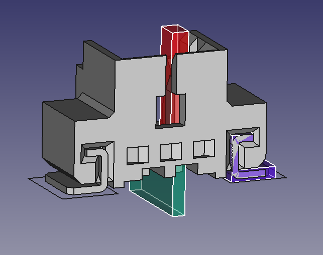

# Auto Generation of Molex Connector 3D Model

## Motivation 

KiCad has the ability to render the PCB in 3D, which helps the mechanical design of the enclosure. Unfortunately, KiCad's 3D model management is a mess. KiCad separates the schematic symbol library from the footprint library, which may be argued as a useful feature, albeit with lots of controversy. The official KiCad footprint library is entirely online based, meaning that it is not locally installed and must be retrieved from github each time user launches the library browser. However, KiCad's 3D model management is left behind and stuck with the schematic library, which certainly does not help with all the confusion and frustration towards KiCad's library scheme. Another problem in the view of mechanical engineer is the decision of using VRML instead of STEP as 3D model file format. VRML is essentially a mesh format which discards all the geometrical information of the original model. I guess there wasn't any usable open source MCAD engine out there when KiCad decides to add the 3D capability. But FreeCAD is pretty matured now, and wow, the latest version 0.16 is so much stabler than the previous versions. There is a some non-official effort of turning FreeCAD as the MCAD companion for KiCad, notably the [FreeCAD-PCB](https://sourceforge.net/projects/eaglepcb2freecad/) and [KiCadStepUp](https://sourceforge.net/p/kicadstepup/wiki/Home/).

This little project is inspired by KiCadStepUp. It presents an alternative simpler solution to generate 3D model for both KiCad (VRML) and FreeCAD (STEP) utilizing an existing STEP model. In this case, the model directly come from the manufacture. You can simply use KiCadStepUp's script or its (rather primitive) GUI to align and convert the STEP model to VRML, but it's such a pain to deal with these tedious tasks when you have hundreds of different parts with just a little variation like the pin count and mounting type. In the case of Molex connectors, KiCadStepUp provides two scripts to generate two series of connects from scratch. But then, it is equally painful, if not more, to write a pure parametric model script for a new series of connectors. And there is more than a handful from Molex, let alone other manufactures. Luckily, Molex provides the STEP model for their connectors. I am assuming it is recently added, because they are not used by either KiCad official library or KiCadStepUp. This project presents a way to use a template to modify the model from the manufactures and exports VRML for KiCad and STEP for FreeCAD with the exact same visual appearance and alignment. 

## Work Flow

Okay, the title is a bit misleading. It is not fully automatic. You need to build a template first, for each different serie of connectors. The process is very simply though, comparing to hand written parametric model scripts, and can be done in a few minutes. 

* Download the STEP model from Molex website, and put the `.stp` files into the `feeds` directory. The template doesn't yet support extrapolating the connectors of the same series. So you'll have to download the step file for each connector you'd like to export, not just one for each series.

* Create a new FreeCAD file

* Load the Molex STEP file for connector with the least pin number in the series, usually two.

* Orient the model such that the connecting portion of the pins (not the soldering portion) is facing you. 

* Use `Sketcher` and `Part` to extrude a rectangle to isolate the left most pin. It is a lot easier if you create sketch on some plane of the existing model. But I'd suggest you detach the sketch support afterwards, so that you don't have any unnecessary dependency when copy the object to the template file. To detach it, first make sure all external geometry in the sketch are deleted. Then type in the console `App.ActiveDocument.<sketch name>.Support = None`

* Use `Draft` to create an array of the extrusion with `interval X` set to the pin pitch, `Number Y` set to one, and `Number X` set to two. Once the generation script sees its an array, it will adjust the placement and `Number X` according to the actual pin count of the part.

* Do the same for the corresponding soldering potion of the pin

* If it is surface mounted, then create an extrusion to isolate the left most (the same side of the pin you've isolated) fitting nail.

* Create a mirror of the extrusion along the YZ plane.

* Fuse the extrusion with its mirror. Once the script sees a `Part::Feature` contains a mirror child shape, it will adjust its source X placement to offset the feature according to the pin count.

* Now, comes the clever part. You shall name the arrays and fusion above to tell the python generation script how to color the model. The naming format is `<name>#<color name>#`, e.g. `pinUp#gold pins#`, or `pinDown#metal grey pins#`. The `<name>` part doesn't matter, as long as it contains no `#`. The color names are taken from the KiCadStepUp VRML export script, as shown below

| | | | |
|---|---|---|---|
| metal grey pins | gold pins |  black body | resistor black body |
| grey body | dark grey body | brown body | light brown body |
| blue body | green body | orange body | red body |
| pink body | yellow body | white body | light brown label |
| led red | led green | led blue | led white |

* Fuse the pin and nail together, and give it a more fancy name as `<name>#<color>#<pitch>#<export name template>#`, e.g. `body-53780#white body#1.25#Molex_Panelmate-%e-%o_%cx%pmm_Angled#`. The `<export name template>` tells the script how to name the export files. The supported formatter are shown below,

Formatter | Description
--- | ---
`%e` | Part series number, taken from the first 5 characters from Molex STEP file name, e.g. for `530470210.stp`, it's `53047`
`%o` | Part number postfix, taken from the last 4 characters from Molex STEP file name, e.g. for `530470210.stp`, it's `0210`
`%c` | pin count
`%p` | pitch

* Load the corresponding KiCad footprint using [KiCadStepUp](https://sourceforge.net/p/kicadstepup/wiki/Home/). Check the linked wiki for instruction. I wouldn't use its current GUI for the alignment though. It's kinda awkward and has some issue with Windows GUI zooming feature. Simply use FreeCAD's placement dialog to align the SOLID to the footprint. And duplicate that placement to the fusion created in the previous step. The script will use this placement to align the generated parts.

* Finally, copy the Fusion object to the template file, named `molexTemplate.FCStd` in this repository. Make sure you copy all the dependency, as well.

* Now, just run the script `molexGen.py`, and collect the results in `exports` directory. Make sure you start FreeCAD in the same directory of the script. The script simply create the body they cutting the imported SOLID with the last fusion created, and then create an intersection for each sub shapes inside the fusion with the SOLID, assign the color and placement for each generated shapes, and then export.

A few hidden features, inside `molexGen.py` `export()` function, there are parameters that you can play with to save the resulting `FCStd` file, or export footprint as `dxf` file.

## Conclusion

This little project is more of way to demonstrate an alternative hybrid approach of using FreeCAD GUI to create template and scripts to automate tedious tasks, rather than going full parametric scripts. 

A side note, regarding the parametric scritping stuff, or more specifically [CadQuery](http://parametricparts.com/docs/cadquerybasics.html) and [cadquery-freecad-module](https://github.com/jmwright/cadquery-freecad-module), it will be really great if they can integrate parameter tuning into the FreeCAD GUI (a must have feature for any parametric CAD in my opinion, which FreeCAD should have had it built-in in the first place. The recently added expression engine is a welcome first step. But I wouldn't dare to use it for any serious project just yet). I mean you can't seriously expect the user to modify the parameters in the scripts every time in order to generate a different model, can you? I think it can be easily done using `Part::PythonFeature`. Maybe I'll tackle this when I have time.

